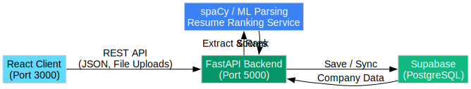

# Resume Ranking System

Welcome to the modernized **Resume Ranking System**. This project has recently undergone a major architectural migration: we have entirely sunsetted the legacy Node.js/Mongoose REST API in favor of a fast, native **Python FastAPI** and **Supabase (PostgreSQL)** service.

## 🚀 Architecture Overview

This system fundamentally operates across 3 interconnected domains:

1. **Frontend**: React-based SPA (Single Page Application) styled with Tailwind CSS and Framer Motion for beautiful micro-animations.
2. **Backend Engine**: A Python-based FastAPI application serving asynchronous HTTP requests. It organically hosts and computes NLP tasks natively without spawning expensive external OS sub-processes.
3. **Database**: Supabase PostgreSQL handles relational tracking of companies, parsed resume features, and computed rankings.

### Pipeline Diagram



*(Generated via Graphviz)*

---

## 🎨 User Interface Highlights

### 1. Dashboard & Resume Upload
The landing page allows candidates to instantaneously upload their `.pdf` or `.docx` resumes. The backend extracts deep syntactic knowledge, runs it against the ML NLP engines seamlessly, and returns a UUID payload in milliseconds.


### 2. Company Directory
The system incorporates data derived directly from the massive `BTech_Companies_NLP` dataset, holding deep analysis parameters (minimum CPIs, preferred technologies, core subjects) for hundreds of top-tier engineering companies.


### 3. Dynamic Analysis & Ranking Board
After a resume is computed, candidates can preview their semantic extraction profile (Education, Experience, Project Keywords).

Most crucially, they have an auto-generated leaderboard that scores and ranks their alignment with all active companies to identify primary hiring targets.


---

## 🛠 Next-Gen Improvements

#### Eradicating the N+1 Database Query Problem
Under the earlier iterations of the backend, rendering the **Analysis Dashboard** produced over 300 sequential database queries over the network, drastically slowing down user requests and blocking the Python thread pool.

This was resolved with **Bulk `.in_()` Fetching**. The FastAPI endpoint `/api/resumes/{uid}` has been rewritten to intercept the UUIDs of ranked companies and resolve all of them using a single efficient Supabase metadata query—reducing execution time from several seconds to milliseconds.

#### NLP Pipeline Enhancements
Previously, `spaCy` operations had to be booted into an independent Node.js child-process shell on every single upload. By housing the REST endpoints in the exact same native Python execution environment as the machine learning scripts, models are securely loaded and cached into RAM immediately on boot, skipping heavy initialization phases entirely.

---

## 👨‍💻 Running Locally

You'll need two separate terminal sessions to start the stack concurrently.

**1. Launch the React Client**
```bash
cd client
npm start
```
*Frontend runs on http://localhost:3000*

**2. Launch the FastAPI Backend**
```bash
cd server
python -m venv venv
venv\Scripts\activate
pip install -r requirements.txt

# Activate via Uvicorn for hot-reloading
uvicorn app.main:app --reload --port 5000
```
*Backend runs on http://127.0.0.1:5000*

Make sure the backend `server/.env` file correctly embeds your `SUPABASE_URL` and `SUPABASE_SERVICE_KEY`.

---

## 👥 Team Contributions

*This project was developed through the collaborative efforts of the following team members:*

| Team Member | Core Contributions |
| :--- | :--- |
| **Aditya Onam** | *Lead Developer* - System Migration, Python NLP Pipeline, User Interface, & Supabase Integration. |
| **[Teammate Name]** | *[Role]* - [Placeholder for contributions] |
| **[Teammate Name]** | *[Role]* - [Placeholder for contributions] |

> **Note:** Please update this placeholder section with your teammate's names and specific project contributions!
