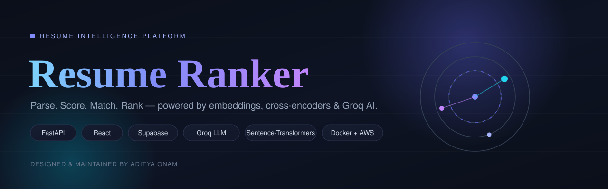

<div align="center">



# Resume Ranker

**Parse resumes, score them against ATS heuristics, and rank candidates against company hiring criteria — powered by embeddings, a cross-encoder reranker, and Groq-hosted LLM inference.**

[](LICENSE)
[](server)
[](client)
[](server/app/core/database.py)
[](server/app/services/llm_service.py)
[](#deployment)

**[Live Frontend](https://resume-ranker-frontend-psi.vercel.app)** · **[Backend API](http://13.202.91.239:10000)** · **[API Docs (Swagger)](http://13.202.91.239:10000/docs)**

</div>

---

## Table of Contents

- [Overview](#overview)
- [Architecture](#architecture)
- [Features](#features)
- [Tech Stack](#tech-stack)
- [Project History & Evolution](#project-history--evolution)
- [Results & Performance](#results--performance)
- [Getting Started](#getting-started)
- [Environment Variables](#environment-variables)
- [Deployment](#deployment)
- [How to Use the Application](#how-to-use-the-application)
- [Contributors](#contributors)
- [Scope for Improvement](#scope-for-improvement)
- [License](#license)

---

## Overview

Resume Ranker takes a candidate's resume (PDF/DOCX), extracts structured data from it with an LLM, computes an ATS (Applicant Tracking System) compatibility score, embeds it, and ranks it against every company in the index using a two-stage retrieval pipeline — a fast bi-encoder pre-filter followed by an accurate cross-encoder rerank. Recruiters/companies get a matching pool of eligible candidates; candidates get a transparent score breakdown and an AI-written gap analysis explaining exactly what's missing.

The system started as a Node.js/Express/MongoDB group project and has since been fully migrated to a Python/FastAPI + Supabase (Postgres) architecture, redesigned end-to-end on the frontend, and hardened for a real cloud deployment (see [Project History](#project-history--evolution) below).

## Architecture

```
Browser
  │  HTTPS, Bearer JWT (Supabase Auth)
  ▼
React SPA (client/) — Vercel
  │  REACT_APP_API_URI
  ▼
FastAPI backend (server/) — Docker container on AWS EC2
  ├── spaCy + Sentence-Transformers bi-encoder + CrossEncoder  (in-process ML pipeline)
  ├── Groq API  (LLM: resume/JD extraction, gap analysis, ATS feedback)
  └── Supabase client (service role key)
        ├── Postgres  (companies, resumes, rankings, jobs, ats_history)
        ├── Auth      (JWT verification per request)
        └── Storage   (uploaded resume files)
```

Every request is authenticated server-side against Supabase (`app/core/security.py` calls `supabase.auth.get_user(token)`) — the backend never trusts a client-supplied user id. CORS is environment-gated: production refuses to boot without an explicit `FRONTEND_ORIGINS` allowlist.

## Features

- **Resume upload & background processing** — drag-and-drop a PDF/DOCX (max 10MB); a live step tracker shows parsing → ATS scoring → embedding → company matching while a background job runs, with status polling.
- **LLM-powered structured extraction** — contact info, education, experience, projects, and skills are extracted from raw resume/JD text with strict anti-hallucination prompting (returns `null`/`[]` rather than guessing).
- **ATS scoring engine** — a rule-based + LLM-narrated score covering formatting, action verbs, keyword density, and metrics usage, with a natural-language gap analysis.
- **Two-stage company matching** — hard eligibility filters (CPI cutoff, branch, DSA requirement) → cheap bi-encoder cosine pre-filter → expensive CrossEncoder rerank only on the top-K candidates, keeping per-upload latency low even against a large company index.
- **Per-user ranking isolation** — a candidate's rank and `totalResumes` are always scoped to that user's own resume pool, matching the same isolation enforced on every read path.
- **Company directory & AI-assisted onboarding** — paste a raw job description and "Auto-Fill with AI" extracts a structured company record (role, CPI cutoff, required skills, DSA/campus-visit flags) for review before saving.
- **ATS dashboard & leaderboard** — browse every uploaded candidate, drill into a full parsed profile with per-company breakdowns, or view a cross-candidate leaderboard (globally, or scoped to one company).
- **GitHub enrichment** *(optional)* — pulls public repo signal for a candidate when a GitHub token is configured.

## Tech Stack

| Layer | Technology |
|---|---|
| Frontend | React (CRA + craco), Tailwind CSS, TanStack Query, React Router |
| Backend | FastAPI, Python 3.10, Uvicorn |
| ML / NLP | spaCy, Sentence-Transformers (bi-encoder + CrossEncoder), PyTorch (CPU-only wheels) |
| LLM | Groq API (default), with Gemini and local Ollama as swappable providers |
| Database & Auth | Supabase (Postgres, Auth, Storage) |
| Infra | Docker, Docker Compose, AWS EC2 (`ap-south-1`), Vercel (frontend) |

## Project History & Evolution

This project has gone through several distinct architectural eras. The git history was intentionally reset to a single commit during a 2026 security cleanup (see below), so this section is the canonical record of how the system got here.

1. **v1 — Node.js / Express / MongoDB.** Original group project: a Node.js REST API with Mongoose/MongoDB, basic keyword/TF-IDF skill extraction, and a Create React App frontend calling it directly.
2. **Migration to Python/FastAPI + Supabase.** The backend was rewritten in FastAPI with Supabase Postgres replacing MongoDB, moving NLP work in-process (spaCy models loaded once at boot) instead of shelling out per request.
3. **ML ranking pipeline.** Introduced a bi-encoder (`all-MiniLM-L6-v2`) for cheap similarity pre-filtering and a CrossEncoder (`ms-marco-MiniLM-L-6-v2`) for accurate resume↔JD scoring, cutting a single upload's ranking time against 138 companies from ~90s to a fraction of that.
4. **LLM integration — three providers, in order.** Resume/JD parsing and AI-written feedback started on a **local Ollama** server (`llama3.2:1b`, ~53s per generation on CPU with zero contention), moved to **Google Gemini**, and finally settled on **Groq** (hosted, ~0.6–0.8s per call) as the default — eliminating the need to run any LLM infrastructure alongside the API.
5. **Storage migration.** Resume uploads moved from local container disk (which doesn't survive redeploys/restarts) to **Supabase Storage**.
6. **Frontend redesign ("Nocturne").** The dashboard was rebuilt with a new dark, editorial visual design, PDF export for results, and inline error surfaces replacing blocking `window.alert()` calls.
7. **Ranking engine rewrite.** Fixed a silent scoring crash (an undefined variable reference was quietly dropping every eligible candidate's score), scoped ranking pools per-user, and batched CrossEncoder + database writes across a whole re-rank pass instead of one round-trip per resume.
8. **Security hardening.** An earlier version of the codebase had a hardcoded Postgres superuser password committed in cleartext across a few maintenance scripts. It has since been **rotated**, and the current code reads every credential (`SUPABASE_SERVICE_ROLE_KEY`, `SUPABASE_DB_PASSWORD`, `GROQ_API_KEYS`, `GITHUB_TOKEN`) from environment variables only — none are ever hardcoded or committed. As part of this cleanup, several divergent feature branches were merged into a single clean history and force-pushed as `main`/`dev`.
9. **Containerization & cloud deployment.** The backend was Dockerized (models pre-baked into the image for fully offline runtime startup, CPU-only PyTorch wheels to avoid multi-gigabyte CUDA downloads) and deployed to an AWS EC2 instance in `ap-south-1`, with the frontend on Vercel.

**Fork lineage:** this repository began as a shared team project (see original contributors below); primary development, the architecture migration, the ML/LLM pipeline, the frontend redesign, and current maintenance are by **Aditya Onam**.

## Results & Performance

Measured/observed improvements from the optimization work described above:

| Area | Before | After |
|---|---|---|
| Dashboard data loading | 300+ sequential DB queries per page load | Single batched query via Supabase `.in_()` filters |
| Ranking a resume against 138 companies | ~90 seconds | Bi-encoder pre-filter + batched CrossEncoder on top-K only |
| LLM resume/JD parsing + feedback | ~53s per call (local Ollama, CPU) | ~0.6–0.8s per call (Groq) |
| Cross-encoder scoring correctness | Silently disabled in Docker (cache path mismatch under offline mode meant 30/100 ATS points were always zero) | Fixed — cache paths aligned, and the Docker build now fails fast if models can't load offline |
| Resume upload storage | Local container disk (lost on redeploy) | Supabase Storage (persistent) |
| Docker image | Full CUDA-enabled PyTorch (multi-GB) | CPU-only PyTorch wheels via `--extra-index-url` |

## Getting Started

Run the frontend and backend in separate terminals.

### Backend (FastAPI)

```bash
cd server
python -m venv venv
venv\Scripts\activate        # Windows
# source venv/bin/activate   # macOS/Linux

pip install -r requirements.txt
python -m spacy download en_core_web_sm
uvicorn app.main:app --reload --port 8000
```

Copy `server/.env.example` to `server/.env` and fill in at minimum `SUPABASE_URL`, `SUPABASE_SERVICE_ROLE_KEY`, and a `GROQ_API_KEYS` (get one free at [console.groq.com/keys](https://console.groq.com/keys)). Apply the SQL files in `server/migrations/` against your Supabase project before first run.

The API serves at `http://127.0.0.1:8000`, with interactive docs at `/docs`.

### Frontend (React)

```bash
cd client
npm install
npm start
```

Runs at `http://localhost:3000` and proxies API calls to the backend per `client/package.json`'s `proxy` field.

## Environment Variables

All variables live in `server/.env` (never committed — see `server/.env.example` for the full annotated template):

| Variable | Required | Purpose |
|---|---|---|
| `SUPABASE_URL`, `SUPABASE_SERVICE_ROLE_KEY` | Yes | Database, auth, and storage access. |
| `LLM_PROVIDER` | No (default `groq`) | `groq`, `gemini`, or `ollama`. |
| `GROQ_API_KEYS` | Yes, if using Groq | Comma-separated Groq API keys (rotates on rate limit). |
| `GEMINI_API_KEYS` | Only if `LLM_PROVIDER=gemini` | Comma-separated Gemini API keys. |
| `OLLAMA_HOST`, `OLLAMA_MODEL_NAME` | Only if `LLM_PROVIDER=ollama` | Local/self-hosted Ollama endpoint. |
| `GITHUB_TOKEN` | No | Raises GitHub API rate limits for the optional enrichment feature. |
| `SUPABASE_DB_PASSWORD`, `SUPABASE_DB_HOST` | No | Only needed for the standalone maintenance scripts in `server/` (direct-Postgres access); never used by the API itself. |
| `EMBEDDING_MODEL_NAME`, `CROSS_ENCODER_MODEL_NAME`, `MODEL_CACHE_DIR` | No | ML model configuration; sane defaults baked in. |
| `ENVIRONMENT`, `FRONTEND_ORIGINS` | Yes in production | Set `ENVIRONMENT=production` and a comma-separated CORS allowlist — the app refuses to start in production without it. |

## Deployment

The backend ships as a single Docker image (models pre-downloaded at build time, offline at runtime) via `server/Dockerfile` + `server/docker-compose.yml`:

```bash
cd server
docker compose build
docker compose up -d
```

Currently deployed on an AWS EC2 instance (`ap-south-1`), fronting port `10000` directly. The frontend is deployed separately on Vercel.

## How to Use the Application

1. **Upload a resume** — Dashboard → drag-and-drop or browse a `.pdf`/`.docx` (max 10MB). Watch the pipeline step tracker, then land on the candidate's result page.
2. **Browse companies** — `/companies` lists hiring criteria (CPI cutoff, required skills, branch, DSA requirement); filter and search.
3. **Add a company** — paste a JD, click "Auto-Fill with AI", review the extracted fields, save. Existing resumes are re-ranked against it in the background.
4. **Review candidates** — `/ats` lists every candidate with score + match count; click through for the full parsed profile and per-company breakdown.
5. **Leaderboard** — `/leaderboard` ranks candidates globally by best score, or per-company with eligibility badges.

## Contributors

**Current maintainer & design:**

| Name | Role |
|---|---|
| **Aditya Onam** ([@AdityaOnam](https://github.com/AdityaOnam)) | Architecture, ML/ranking pipeline, LLM integration, frontend redesign, cloud deployment — current maintainer |
| **Aditya Gupta** ([@code-epic-adi](https://github.com/code-epic-adi)) | Backend fixes and the Groq LLM migration work on the deployment branch |

**Original contributors (v1 — Node.js/MongoDB era):**

| Name | Role |
|---|---|
| Aditya Onam ([@AdityaOnam](https://github.com/AdityaOnam)) | Model Designer — weighted scoring algorithm, core ranking architecture |
| Aditya Gupta ([@code-epic-adi](https://github.com/code-epic-adi)) | Data Engineer — resume extraction/preprocessing, PDF parsing |
| Varada Patel | NLP Engineer — skill extraction, TF-IDF keyword analysis |
| Kushal Kesherwani ([@Krishal23](https://github.com/Krishal23)) | Deployment Engineer — original React frontend, Node.js/MongoDB integration |

## Scope for Improvement

- **Postgres Row-Level Security.** User-data isolation is currently enforced entirely in application code (`.eq("user_id", ...)` filters); there's no database-level backstop if a future endpoint forgets a filter.
- **HTTPS in front of the backend.** The EC2 deployment currently serves plain HTTP on port 10000 — a reverse proxy (Caddy/nginx) with a domain + TLS is the natural next step.
- **CI/CD.** Deploys are currently manual (SSH + `docker compose`); a GitHub Actions pipeline would automate build/push/redeploy.
- **Automated tests.** `server/tests/` are ad-hoc manual scripts, not a pytest suite with CI coverage.
- **CORS for preview deployments.** The `FRONTEND_ORIGINS` allowlist is an exact match, so Vercel's per-branch preview URLs can't reach the API today.
- **Horizontal scaling / redundancy.** Single EC2 instance, no load balancer or auto-restart-on-failure beyond Docker's own `restart: unless-stopped`.
- **Rate limiting / API auth hardening** on public-facing endpoints beyond Supabase JWT checks.
- **Company data enrichment automation** — JD ingestion is currently a manual paste-and-review flow; could be extended with scheduled scraping/ingestion.

## License

Released under the [MIT License](LICENSE) © 2026 Aditya Onam.
