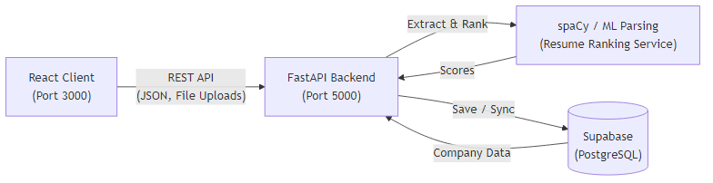
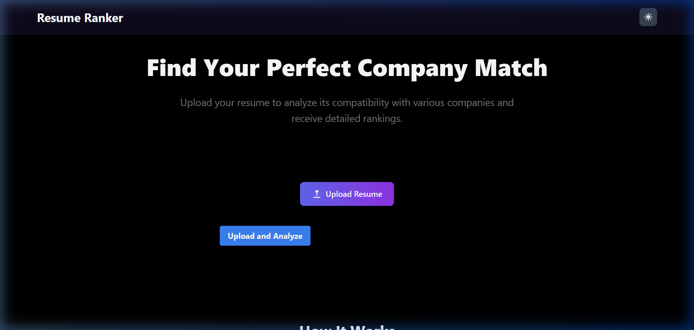
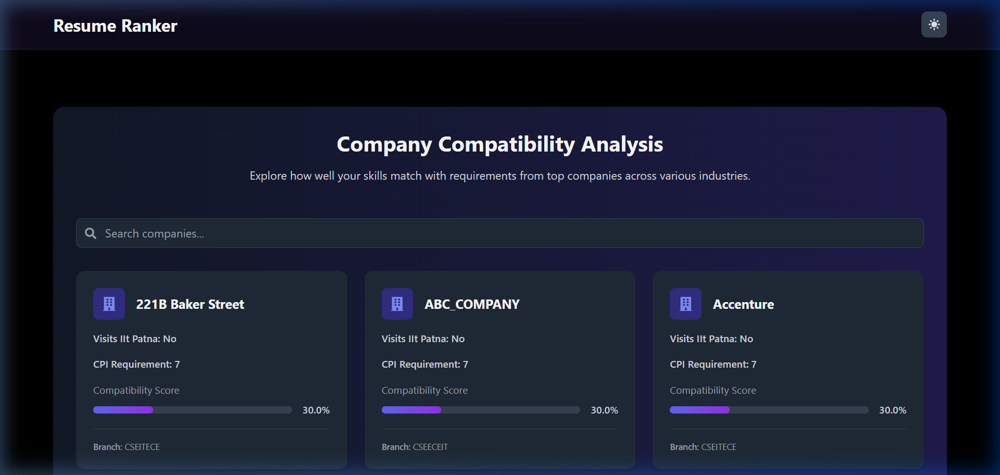
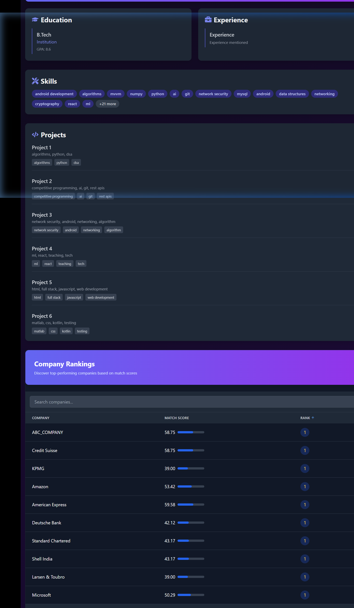

# Resume Ranking System

The Resume Ranking System parses, analyzes, and ranks resumes against company hiring criteria. The system has migrated from a legacy Node.js/Mongoose REST API to a Python FastAPI service integrated with Supabase (PostgreSQL).

## Architecture Overview

The system consists of three main components:

1. **Frontend**: A React-based Single Page Application (SPA) styled with Tailwind CSS and enhanced with Framer Motion animations.
2. **Backend Engine**: A Python-based FastAPI application serving asynchronous HTTP requests. It processes NLP tasks natively, avoiding the overhead of external OS sub-processes.
3. **Database**: Supabase PostgreSQL for relational tracking of companies, resume data, and computed rankings.

### Pipeline Diagram




---

## User Interface Highlights

### 1. Dashboard & Resume Upload
Candidates can upload resumes in `.pdf` or `.docx` format. The backend extracts text, runs the evaluation models, and returns the processing result.



### 2. Company Directory
Displays criteria (such as minimum CPI, preferred technologies, and core subjects) for engineering companies, sourced from the `BTech_Companies_NLP` dataset.



### 3. Analysis & Ranking Leaderboard
Once analyzed, candidates can view their parsed resume details (Education, Experience, Project Keywords) along with a ranked leaderboard matching them with active companies based on score alignment.



---

## Optimization & Improvements

### N+1 Query Resolution
In earlier versions, rendering the analysis dashboard triggered over 300 sequential database queries. This was resolved by implementing bulk fetches using Supabase `.in_()` filters. The `/api/resumes/{uid}` endpoint resolves ranked company metadata in a single batch query, reducing response times from seconds to milliseconds.

### NLP Pipeline Optimization
Previously, `spaCy` operations ran in an independent Node.js child-process shell per upload. Moving the REST API to Python allows the models to be loaded and cached in RAM on boot, eliminating initialization latency for subsequent uploads.

### Ranking Pipeline Rework
The scoring/ranking engine (`server/app/services/rank_service.py`, `company_matcher.py`) had a few correctness and performance issues that have since been fixed:
- **Ranking pool is now scoped per-user.** A resume's rank/`totalResumes` for a company reflects only that user's own resumes, matching the isolation already enforced everywhere else (`GET /resumes/`, all of `analytics.py`) — previously it silently pooled every user's resumes together.
- **Bi-encoder pre-filter before the CrossEncoder pass.** Only the top-K most similar *eligible* companies (cheap cosine similarity on existing embeddings) run the expensive CrossEncoder transformer; the rest are still scored on every other dimension. This is what previously made a single upload take ~90 seconds against 138 companies. Tunable via `RANKING_CROSS_ENCODER_TOP_K`.
- **Batched writes.** Re-ranking now issues one `rankings` update per affected resume (and one batched upsert to the `rankings` table), instead of a separate round-trip per company × resume.
- **Fixed a silent scoring crash.** `compute_company_score` referenced a variable (`education_list`) that was never defined in that method, so every eligible candidate's score calculation threw and was silently dropped by the caller's error handling — eligible companies were effectively never being scored. Fixed.

---

## Running Locally

Run the frontend and backend services in separate terminal sessions.

### 1. FastAPI Backend
```bash
cd server
python -m venv venv
# On Windows:
venv\Scripts\activate
# On macOS/Linux:
# source venv/bin/activate

pip install -r requirements.txt
uvicorn app.main:app --reload --port 8000
```
The backend runs on `http://127.0.0.1:8000`. API docs are available at `http://127.0.0.1:8000/docs`.

Copy `server/.env.example` to `server/.env` and fill in `SUPABASE_URL` and `SUPABASE_SERVICE_ROLE_KEY`. Before the first run, apply the database migrations in `server/migrations/` in order against your Supabase project (e.g. via the Supabase SQL editor, or `psql` if you have direct DB access) — these create the `jobs`/`ats_history` tables and add ATS/company columns used by the app.

For a production deploy, also set `ENVIRONMENT=production` and `FRONTEND_ORIGINS` (a comma-separated list of allowed origins) — the app will refuse to start in production without it.

#### ML model configuration (works unmodified across machines/deployments)

`server/.env.example` documents these; all have sane defaults in `app/core/config.py` so none are required to get started locally:

| Variable | Purpose |
|---|---|
| `OLLAMA_MODEL_NAME`, `OLLAMA_HOST`, `OLLAMA_TIMEOUT_SECONDS` | Which local LLM to use for resume/JD parsing and AI feedback, and where Ollama is running (defaults to `localhost:11434` — point this at a remote/containerized Ollama instance if it isn't co-located with the API). |
| `EMBEDDING_MODEL_NAME`, `CROSS_ENCODER_MODEL_NAME` | HuggingFace model ids for the bi-encoder (fast similarity/embeddings) and cross-encoder (accurate resume↔JD match) models. |
| `MODEL_CACHE_DIR` | Shared on-disk cache for downloaded HF models (defaults to `server/assets/models/cache`, gitignored). First run on a machine downloads into this folder; a deployment that mounts/pre-seeds this folder as a volume skips the download entirely. |
| `RANKING_CROSS_ENCODER_TOP_K` | How many top-similarity eligible companies get the expensive CrossEncoder pass per upload (see "Ranking Pipeline Rework" above). |

If Ollama isn't installed/running, resume parsing and ATS scoring still work (rule-based extraction and scoring) — only the LLM-generated "AI Analysis" narrative on the ATS score card is skipped, gracefully.

### 2. React Client
```bash
cd client
npm start
```
The frontend runs on `http://localhost:3000` and proxies API requests to the backend on port 8000 (see `client/package.json`'s `"proxy"` field).

---

## How to Use the Application

1. **Upload a resume** — go to the Dashboard (`/` or `/upload`) and drag-and-drop or browse for a `.pdf` or `.docx` file (max 10MB). A step tracker shows live progress (parsing → ATS scoring → embedding → company matching) while the backend processes the file in the background; once done, you're taken to the candidate's result page at `/resumes/:id`.
2. **Browse companies** — the Companies page (`/companies`) lists all seeded/added companies and their hiring criteria (minimum CPI, required skills, branches, DSA requirement, campus visit status). Use the search bar and the Filters panel (branch, DSA requirement, max min-GPA) to narrow the list.
3. **Add a company** — from the Companies page, open "Add Company", paste a raw job description, and click "Auto-Fill with AI" to let the LLM extract structured fields (name, role, CPI cutoff, skills, project keywords, DSA/campus-visit flags). Review/edit the fields, then save — existing resumes are re-ranked against the new company in the background.
4. **Review candidates** — the ATS Dashboard (`/ats`) lists every uploaded candidate with their extracted skills, ATS score, and number of company matches. Click a row to open the candidate's full profile in a side panel (parsed contact info, education, experience, projects, and per-company ranking breakdown). From there you can also delete a resume permanently.
5. **Leaderboard** (`/leaderboard`) — by default, ranks every candidate by their single best score across any company. Pick a specific company from the picker at the top to instead rank only candidates who have a ranking entry for that company, sorted by that company's score, with an eligible/not-eligible badge per candidate.

---

## Team Contributions

| Name | Role | Contributions |
|------|------|--------------|
| Aditya Onam ([@AdityaOnam](https://github.com/AdityaOnam)) | Model Designer | - Led the development of the weighted scoring algorithm<br>- Implemented the core ranking system architecture<br>- Generated data for model training |
| Aditya Gupta ([@code-epic-adi](https://github.com/code-epic-adi)) | Data Engineer | - Implemented resume data extraction and preprocessing<br>- Developed the PDF text extraction system<br>- Implemented data validation and cleaning processes<br>- Generated data for model training |
| Varada Patel | NLP Engineer | - Developed the skill extraction system<br>- Implemented text similarity analysis<br>- Enhanced keyword extraction using TF-IDF<br>- Optimized NLP processing performance |
| Kushal Kesherwani ([@Krishal23](https://github.com/Krishal23)) | Deployment Engineer | - Developed the React.js frontend<br>- Implemented the real-time ranking dashboard<br>- Created responsive UI components<br>- Integrated NLP components with the Node.js backend<br>- Integrated MongoDB for efficient data storage |


