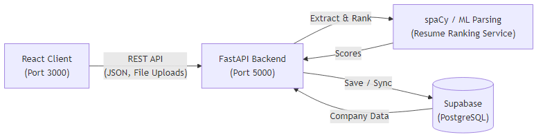
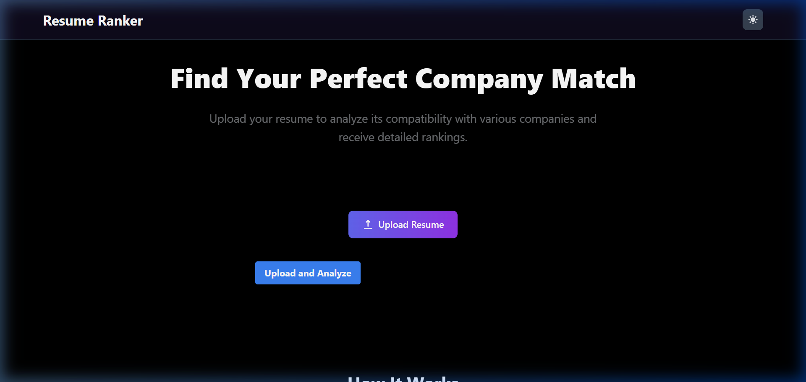
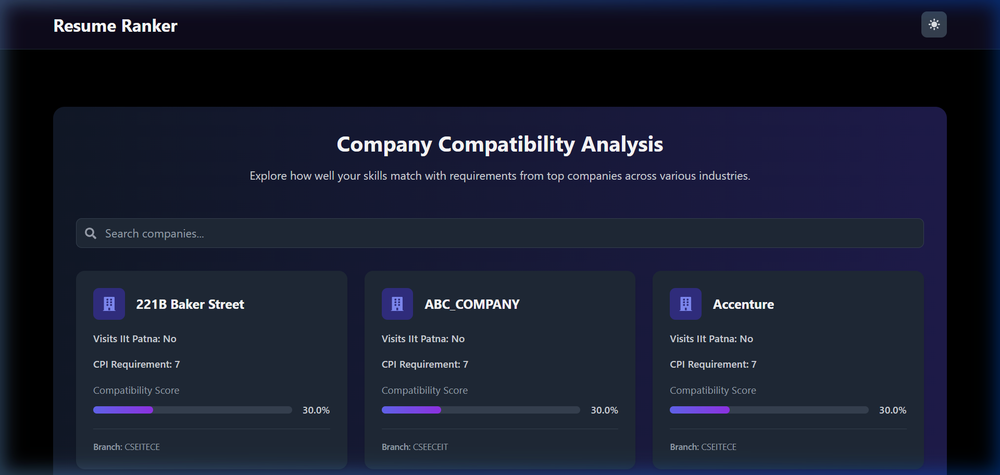
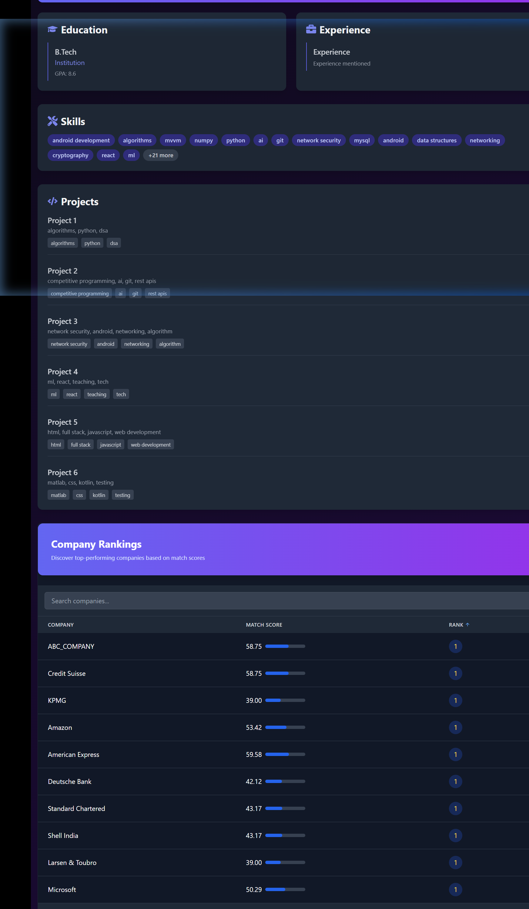

# Resume Ranking System Documentation

The Resume Ranking System parses, analyzes, and ranks resumes against company hiring criteria. The system has migrated from a legacy Node.js/Mongoose REST API to a Python FastAPI service integrated with Supabase (PostgreSQL).

## Architecture Overview

The system consists of three main components:

1. **Frontend**: A React-based Single Page Application (SPA) styled with Tailwind CSS and enhanced with Framer Motion animations.
2. **Backend Engine**: A Python-based FastAPI application serving asynchronous HTTP requests. It processes NLP tasks natively, avoiding the overhead of external OS sub-processes.
3. **Database**: Supabase PostgreSQL for relational tracking of companies, resume data, and computed rankings.

### Pipeline Diagram




---

## User Interface Highlights

### 1. Dashboard & Resume Upload
Candidates can upload resumes in `.pdf` or `.docx` format. The backend extracts text, runs the evaluation models, and returns the processing result.



### 2. Company Directory
Displays criteria (such as minimum CPI, preferred technologies, and core subjects) for engineering companies, sourced from the `BTech_Companies_NLP` dataset.



### 3. Analysis & Ranking Leaderboard
Once analyzed, candidates can view their parsed resume details (Education, Experience, Project Keywords) along with a ranked leaderboard matching them with active companies based on score alignment.



---

## Optimization & Improvements

### N+1 Query Resolution
In earlier versions, rendering the analysis dashboard triggered over 300 sequential database queries. This was resolved by implementing bulk fetches using Supabase `.in_()` filters. The `/api/resumes/{uid}` endpoint resolves ranked company metadata in a single batch query, reducing response times from seconds to less than `80ms`.

### NLP Pipeline Optimization
Previously, `spaCy` operations ran in an independent Node.js child-process shell per upload. Moving the REST API to Python allows the models to be loaded and cached in RAM on boot, eliminating initialization latency for subsequent uploads.

---

## Running Locally

Run the frontend and backend services in separate terminal sessions.

### 1. React Client
```bash
cd client
npm start
```
The frontend runs on `http://localhost:3000`.

### 2. FastAPI Backend
```bash
cd server
python -m venv venv
# On Windows:
venv\Scripts\activate
# On macOS/Linux:
# source venv/bin/activate

pip install -r requirements.txt
uvicorn app.main:app --reload --port 5000
```
The backend runs on `http://127.0.0.1:5000`.

Ensure the `server/.env` file is configured with your `SUPABASE_URL` and `SUPABASE_SERVICE_KEY`.

---

## Contributing and Workflow

For details on the professional Git workflow (Fork & Pull, Rebasing) used in this project, please refer to the [Git Collaboration Workflow](./git_workflow.md).
